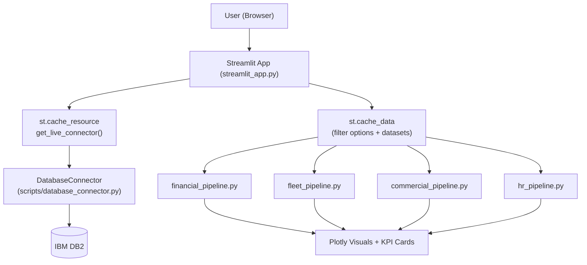

# IE Airlines Executive Command Center (Live DB2)

Live, DB2-connected Streamlit dashboard for executive monitoring of airline performance across:
- Financial Performance
- Fleet Operations & Efficiency
- Commercial & Route Network
- Human Resources
- Executive Overview (cross-pillar)

This version is intentionally **live-connection-first** and uses credentials from `.env`.

## 1. What This Repository Delivers

- A reusable `DatabaseConnector` class (SQLAlchemy + DB2 + `.env`)
- A Streamlit app that uses one cached connection resource for runtime
- KPI pipelines for all dashboard pillars
- Caching for fast interaction (`st.cache_resource` + `st.cache_data`)
- Graceful fallback when optional `COUNTRIES` table is not present
- Unit tests for connector and KPI computation logic

## 2. Repository Structure

```text
advanced-tech-track-project/
├── dashboard/
│   ├── financial_pipeline.py
│   ├── fleet_pipeline.py
│   ├── commercial_pipeline.py
│   ├── hr_pipeline.py
│   └── __init__.py
├── scripts/
│   ├── database_connector.py
│   └── __init__.py
├── tests/
│   ├── test_database_connector.py
│   ├── test_financial_pipeline.py
│   ├── test_fleet_pipeline.py
│   ├── test_commercial_pipeline.py
│   └── test_hr_pipeline.py
├── streamlit_app.py
├── PROJECT_PROPOSAL.md
├── pyproject.toml
├── uv.lock
├── LICENSE
└── README.md
```

## 3. Architecture Map



## 4. Runtime Data Flow and Caching

1. Streamlit initializes one live connector via `@st.cache_resource`.
2. All page filter/data loaders use `@st.cache_data` keyed by schema + filters.
3. Pipelines query DB2 through the shared connector.
4. Computations are performed in memory (pandas/polars) and rendered with Plotly.
5. `Refresh Data Cache` clears both data cache and connection resource cache.

### Performance note

- The first page load can take longer because queries run live against DB2 and multiple KPI datasets are fetched.
- Subsequent interactions are faster due to Streamlit caching (`st.cache_resource` + `st.cache_data`).
- If your network to DB2 is slow/high-latency, first-load times will increase accordingly.

## 5. Database Requirements

### Core tables (required)

- Financial: `TICKETS`, `FLIGHTS`, `ROUTES`, `AIRPLANES`
- Fleet: `FLIGHTS`, `AIRPLANES`, `ROUTES`
- Commercial: `TICKETS`, `PASSENGERS`, `FLIGHTS`, `ROUTES`, `AIRPLANES`, `AIRPORTS`
- HR: `EMPLOYEE`, `DEPARTMENT`, `AIRPLANES`

### Optional table

- `COUNTRIES` (Commercial enrichment only)

If `COUNTRIES` is missing:
- Passenger country falls back to `PASSENGERS.country`
- Passenger continent defaults to `'Unknown'`
- App shows a warning banner; page remains usable

## 6. Setup on Any Machine

### Prerequisites

- Python 3.11+
- [`uv`](https://docs.astral.sh/uv/getting-started/installation/)

### Install dependencies

```bash
uv sync
```

### Create `.env` in project root

```env
DB_USERNAME=your_username
DB_PASSWORD=your_password
DB_HOST=52.211.123.34
DB_PORT=25010
DB_NAME=IEMASTER
DB_SCHEMA=IEPLANE
```

Notes:
- `DB_SCHEMA` is optional in `.env` (default `IEPLANE`), but recommended.
- `.env` is ignored by git.

### Run Streamlit

```bash
uv run streamlit run streamlit_app.py
```

## 7. Running Tests

```bash
uv run python -m unittest \
  tests.test_database_connector \
  tests.test_financial_pipeline \
  tests.test_fleet_pipeline \
  tests.test_commercial_pipeline \
  tests.test_hr_pipeline -v
```

Optional live integration test:

```bash
RUN_DB_INTEGRATION_TESTS=1 uv run python -m unittest tests.test_database_connector -v
```

## 8. Streamlit Cloud Deployment

### App entry point

- `streamlit_app.py`

### Secrets mapping

In Streamlit Cloud, add these in **App Settings -> Secrets**:

```toml
DB_USERNAME="your_username"
DB_PASSWORD="your_password"
DB_HOST="52.211.123.34"
DB_PORT="25010"
DB_NAME="IEMASTER"
DB_SCHEMA="IEPLANE"
```

The connector loads environment variables, so secrets are consumed the same way as local `.env`.

## 9. Troubleshooting

- `Missing required database environment variables`:
  - Confirm all required keys exist in `.env` or Streamlit secrets.
- `NoSuchModuleError: sqlalchemy.dialects:db2.ibm_db`:
  - Run `uv sync` to install `ibm-db-sa`.
- `Page unavailable ... missing core tables`:
  - Set `DB_SCHEMA` to a schema that contains required tables.
- Commercial warning about `COUNTRIES` missing:
  - Expected fallback behavior; install/add `COUNTRIES` for full geo enrichment.
- Dashboard is slow on first load:
  - Expected with live DB2 mode. Wait for initial cache warm-up, then navigation/filtering should be noticeably faster.
  - Use **Refresh Data Cache** only when needed, since it forces data reload from DB2.

## 10. Security and Collaboration Notes

- Never commit `.env`.
- Keep credentials personal per teammate.
- Use feature branches and PRs for all changes.
